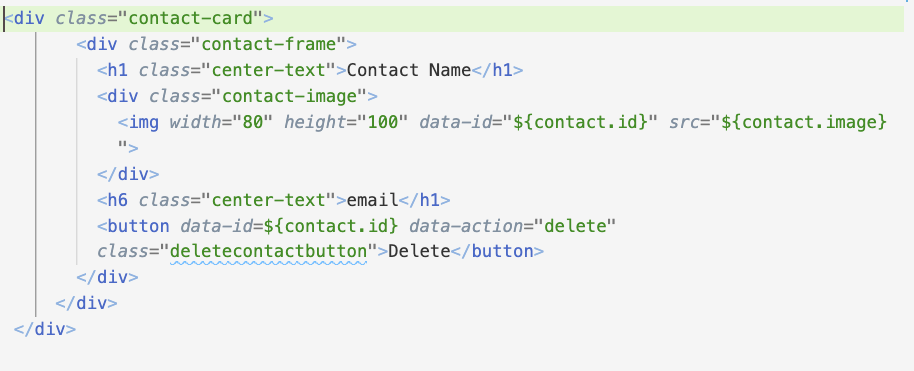

# contact_book_js

This is a Javascript practice. Html, Css, and Javascript file tree is started.

html for contact card 
1. Use the format from the html picture bellow into javascript 
2. edit the text so that you have dynamic contact cards 

